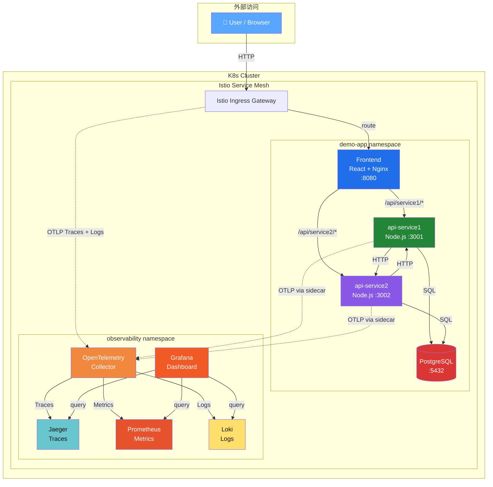
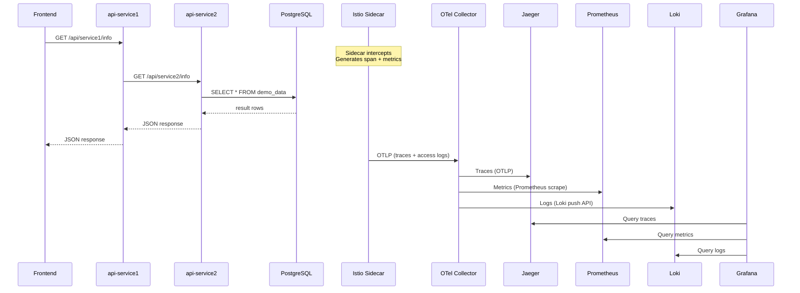

# 🔭 Cloud Native Observability Demo

**Istio + OpenTelemetry Collector + Jaeger + Prometheus + Loki + Grafana**

> 在 Kubernetes 上一键部署前后端分离微服务应用，实现 **Traces · Metrics · Logs** 全链路可观测。

---

## 📐 架构概览



---

## 🔗 调用链路 (Call Chains)

| 链路 | 流程 | 说明 |
|------|------|------|
| **链路 A** | `Frontend → api-service1 → api-service2 → PostgreSQL` | 前端调用 service1，service1 再调 service2，service2 查 DB |
| **链路 B** | `Frontend → api-service2 → api-service1 → PostgreSQL` | 前端调用 service2，service2 再调 service1，service1 查 DB |

每条请求都有 **完整 TraceID**，在 Istio、Jaeger、Loki、Grafana 中能联动查询。

---

## 📦 目录结构

```
Istio/
├── deploy.sh                    # 🚀 一键部署脚本 (Linux/Mac)
├── deploy.ps1                   # 🚀 一键部署脚本 (Windows PowerShell)
├── README.md                    # 📖 本文档
├── k8s/
│   ├── 00-namespaces.yaml       # 命名空间: demo-app + observability
│   ├── 01-postgres.yaml         # PostgreSQL + 初始化数据
│   ├── 10-api-service1.yaml     # 后端微服务 1
│   ├── 11-api-service2.yaml     # 后端微服务 2
│   ├── 12-frontend.yaml         # React 前端
│   ├── 20-istio-telemetry.yaml  # Istio Telemetry (Traces + AccessLogs → OTel)
│   ├── 21-istio-gateway.yaml    # Istio Gateway + VirtualService + DestinationRule
│   ├── 30-otel-collector.yaml   # OpenTelemetry Collector
│   ├── 31-jaeger.yaml           # Jaeger (All-in-One)
│   ├── 32-prometheus.yaml       # Prometheus
│   ├── 33-loki.yaml             # Loki
│   └── 34-grafana.yaml          # Grafana (预配置数据源)
└── src/
    ├── api-service1/            # Node.js + Express (端口 3001)
    │   ├── package.json
    │   ├── server.js
    │   └── Dockerfile
    ├── api-service2/            # Node.js + Express (端口 3002)
    │   ├── package.json
    │   ├── server.js
    │   └── Dockerfile
    └── frontend/                # React SPA + Nginx (端口 8080)
        ├── package.json
        ├── public/index.html
        ├── src/
        │   ├── index.js
        │   ├── App.js
        │   └── App.css
        ├── nginx.conf
        └── Dockerfile
```

---

## 🚀 一键部署

### 前置条件

| 组件 | 版本要求 | 安装方式 |
|------|---------|---------|
| Kubernetes | ≥ 1.27 | k3s / minikube / kind |
| Istio | ≥ 1.20 | `istioctl install --set profile=demo -y` |
| Docker | ≥ 24 | [docker.io](https://docker.io) |
| kubectl | ≥ 1.27 | [kubernetes.io](https://kubernetes.io/docs/tasks/tools/) |

### 部署步骤

```bash
# 1. 确保 K8s 集群运行中
kubectl cluster-info

# 2. 安装 Istio（如果还未安装）
istioctl install --set profile=demo -y
kubectl label namespace default istio-injection=enabled --overwrite

# 3. 进入 Istio 目录
cd Istio/

# 4. 一键部署！
chmod +x deploy.sh
./deploy.sh

# 或者用 kubectl 逐个部署：
kubectl apply -f k8s/00-namespaces.yaml
kubectl apply -f k8s/01-postgres.yaml
kubectl apply -f k8s/10-api-service1.yaml
kubectl apply -f k8s/11-api-service2.yaml
kubectl apply -f k8s/12-frontend.yaml
kubectl apply -f k8s/30-otel-collector.yaml
kubectl apply -f k8s/31-jaeger.yaml
kubectl apply -f k8s/32-prometheus.yaml
kubectl apply -f k8s/33-loki.yaml
kubectl apply -f k8s/34-grafana.yaml
kubectl apply -f k8s/20-istio-telemetry.yaml
kubectl apply -f k8s/21-istio-gateway.yaml
```

---

## 🔌 访问入口

| 服务 | URL | 端口 | 说明 |
|------|-----|------|------|
| 🖥 **Frontend** | `http://<NODE_IP>:<ISTIO_INGRESS_PORT>` | 80 (via Istio Gateway) | React 应用 |
| 📊 **Grafana** | `http://<NODE_IP>:30090` | 30090 (NodePort) | 统一可观测面板 |
| 🔍 **Jaeger** | `http://<NODE_IP>:30091` | 30091 (NodePort) | 分布式追踪 |
| 📈 **Prometheus** | `http://<NODE_IP>:30092` | 30092 (NodePort) | 指标查询 |

**端口转发（如果 NodePort 不通）：**
```bash
kubectl port-forward -n istio-system svc/istio-ingressgateway 8080:80 &
kubectl port-forward -n observability svc/grafana 3000:3000 &
kubectl port-forward -n observability svc/jaeger 16686:16686 &
kubectl port-forward -n observability svc/prometheus 9090:9090 &
```

---

## 🧪 测试验证

### 1. 测试 API 调用链

```bash
# 获取 Istio Ingress Gateway 地址
export INGRESS_HOST=$(kubectl get nodes -o jsonpath='{.items[0].status.addresses[?(@.type=="InternalIP")].address}')
export INGRESS_PORT=$(kubectl -n istio-system get service istio-ingressgateway -o jsonpath='{.spec.ports[?(@.name=="http2")].nodePort}')

# 测试链路 A：Frontend → service1 → service2 → PostgreSQL
curl http://${INGRESS_HOST}:${INGRESS_PORT}/api/service1/info | jq

# 测试链路 B：Frontend → service2 → service1 → PostgreSQL
curl http://${INGRESS_HOST}:${INGRESS_PORT}/api/service2/info | jq

# 健康检查
curl http://${INGRESS_HOST}:${INGRESS_PORT}/api/service1/health
curl http://${INGRESS_HOST}:${INGRESS_PORT}/api/service2/health
```

### 2. 验证 Jaeger Trace

1. 打开 Jaeger: `http://<NODE_IP>:30091`
2. Service 下拉选择任意服务（如 `frontend.demo-app`）
3. 点击 **Find Traces**
4. 点击任一条 Trace 查看完整调用链：
   ```
   frontend →
     api-service1 →
       api-service2 →
         postgres (SQL query)
   ```

### 3. 验证 Prometheus Metrics

1. 打开 Prometheus: `http://<NODE_IP>:30092`
2. 查询以下指标：
   ```promql
   # 请求总量
   istio_requests_total
   
   # 请求延迟 P99
   histogram_quantile(0.99, sum(rate(istio_request_duration_milliseconds_bucket[5m])) by (le, destination_service_name))
   
   # 请求成功率
   sum(rate(istio_requests_total{response_code=~"2.."}[5m])) / sum(rate(istio_requests_total[5m]))
   ```

### 4. 验证 Loki Logs

1. 打开 Grafana: `http://<NODE_IP>:30090`
2. 左侧菜单 → **Explore** → 数据源选 **Loki**
3. 查询日志：
   ```logql
   {namespace="demo-app"} |= ""
   ```
4. 点击日志行中的 **TraceID** 链接，直接跳转到 Jaeger 查看对应 Trace

### 5. 验证 Grafana 联动

Grafana 已预配置三个数据源联动：

- **Jaeger → Loki**: Trace 页面可关联查询日志
- **Loki → Jaeger**: 日志中的 `traceid` 可直接跳转到 Jaeger Trace
- **Prometheus → 全链路**: 指标异常时可下钻查看 Trace

---

## 📊 可观测数据流



---

## 🔧 自定义配置

### 修改采样率

编辑 `k8s/20-istio-telemetry.yaml`:
```yaml
spec:
  tracing:
    - randomSamplingPercentage: 50.0  # 改为 50%
```

### 添加新的 Grafana Dashboard

编辑 `k8s/34-grafana.yaml` 中的 `grafana-dashboard-istio` ConfigMap，添加 JSON Dashboard。

### 扩展微服务

复制 `src/api-service1/` 目录，修改端口和逻辑，创建新的 Deployment YAML。

---

## 🧹 清理

```bash
# 删除所有部署
kubectl delete namespace demo-app
kubectl delete namespace observability

# 清理 Istio Telemetry
kubectl delete -f k8s/20-istio-telemetry.yaml

# 卸载 Istio（如果不再需要）
istioctl uninstall --purge -y
kubectl delete namespace istio-system
```

---

## 📝 技术栈

| 组件 | 镜像 | 用途 |
|------|------|------|
| **Istio** | `istio/proxyv2` | Service Mesh，自动 Sidecar 注入 |
| **OpenTelemetry Collector** | `otel/opentelemetry-collector-contrib:0.102.0` | 统一可观测数据管道 |
| **Jaeger** | `jaegertracing/all-in-one:1.57` | 分布式追踪存储与 UI |
| **Prometheus** | `prom/prometheus:v2.52.0` | 指标采集与存储 |
| **Loki** | `grafana/loki:3.0.0` | 日志聚合与存储 |
| **Grafana** | `grafana/grafana:11.0.0` | 统一可视化面板 |
| **PostgreSQL** | `postgres:16-alpine` | 演示数据库 |
| **api-service1/2** | `node:18-alpine` (base) | 后端微服务 |
| **Frontend** | `node:18-alpine` + `nginx:alpine` | React 前端 |

> ✅ 所有镜像均为 **Docker Hub 官方公共镜像**，无需私有仓库。

---

## ❓ FAQ

**Q: 为什么 Istio sidecar 没有注入？**
A: 确保 namespace 有 `istio-injection=enabled` label，并且重启 Pod：
```bash
kubectl label namespace demo-app istio-injection=enabled --overwrite
kubectl rollout restart deployment -n demo-app
```

**Q: Jaeger 中没有 Trace？**
A: 检查 OTel Collector 日志：
```bash
kubectl logs -n observability -l app=otel-collector
```

**Q: Grafana 数据源报错？**
A: 等待所有 Pod Ready，Grafana 需要 10-20 秒加载数据源配置。

**Q: 如何在 VMware 虚拟机中使用？**
A: 在 VM 上安装 k3s：
```bash
curl -sfL https://get.k3s.io | sh -
sudo cp /etc/rancher/k3s/k3s.yaml ~/.kube/config
# 然后运行 ./deploy.sh
```
